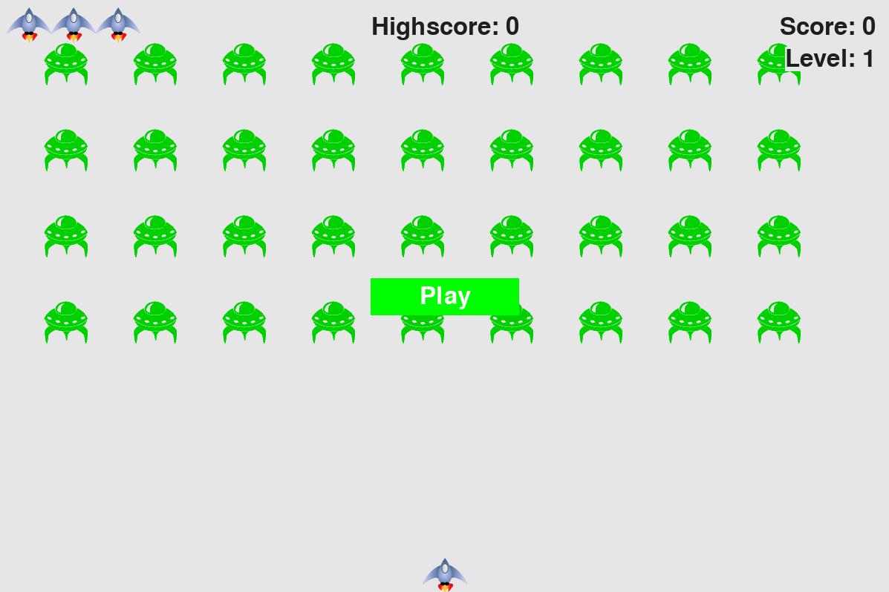

# alien_invasion

In Alien Invasion, the player controls a rocket ship that appears
at the bottom center of the screen. The player can move the ship
right and left using the arrow keys and shoot bullets using the
spacebar. When the game begins, a fleet of aliens fills the sky
and moves across and down the screen. The player shoots and
destroys the aliens. If the player destroys all the aliens, a new fleet
appears that moves faster than the previous fleet. If any alien hits
the player’s ship or reaches the bottom of the screen, the player
loses a ship. If the player loses three ships, the game ends.

<div align=center margin=auto> 
  
</div>


## Table of Contents
1. [Prerequisites](README.md#prerequisites)
2. [Installation on Linux](README.md#installation-on-linux)
    * [Standard dependencies](README.md#standard-dependencies)
    * [Repository import](README.md#repository-import)
    * [Project-specific dependencies](README.md#project-specific-dependencies)
3. [How to run](README.md#how-to-run)


## Prerequisites
To run the program, you need the following components installed:

**Standard dependencies**
- Python 3.x
- Pip
- Git
- Pipenv (optional, if you want to keep dependencies and run the program in a 
virtual environment) 

**Project-specific dependencies**
- Pygame


## Installation on Linux

### Standard dependencies
Please refer to the corresponding official sources for:
- Python: https://www.python.org/downloads/
- Pip: https://pip.pypa.io/en/stable/installation/
- Git: https://git-scm.com/book/en/v2/Getting-Started-Installing-Git
- Pipenv: https://pipenv.pypa.io/en/latest/

### Repository import
- Go to the directory you'd like to have this repository in and open the 
directory in terminal
- Enter the following command:

```
>>> git clone https://github.com/okharkevych/alien_invasion.git
```

### Project-specific dependencies
To install Pygame, enter the following command in terminal:

```
>>> python3 -m pip install --user pygame
```
OR (if using pipenv virtual environment)
```
>>> pipenv shell
>>> pipenv install pygame
```

## How to run
- Open alien_invasion directory downloaded earlier in terminal
- Enter the following command:

```
>>> python3 -m alien_invasion
```
OR (if using pipenv virtual environment)
```
>>> pipenv shell
>>> python -m alien_invasion
```
